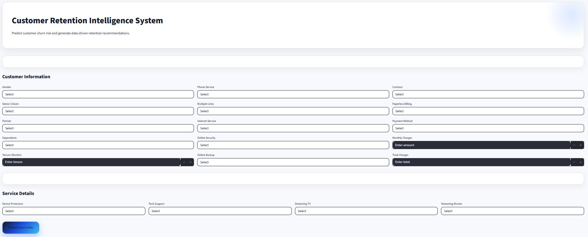
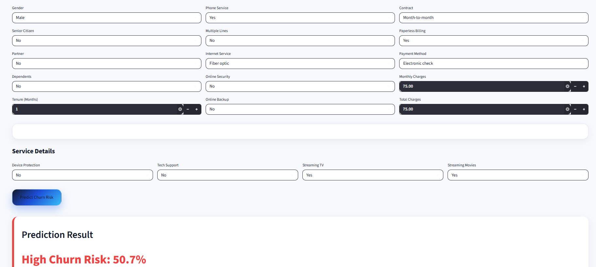
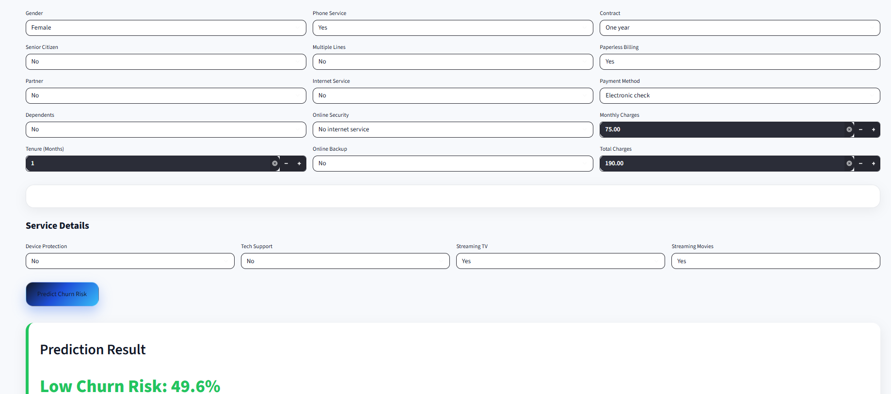
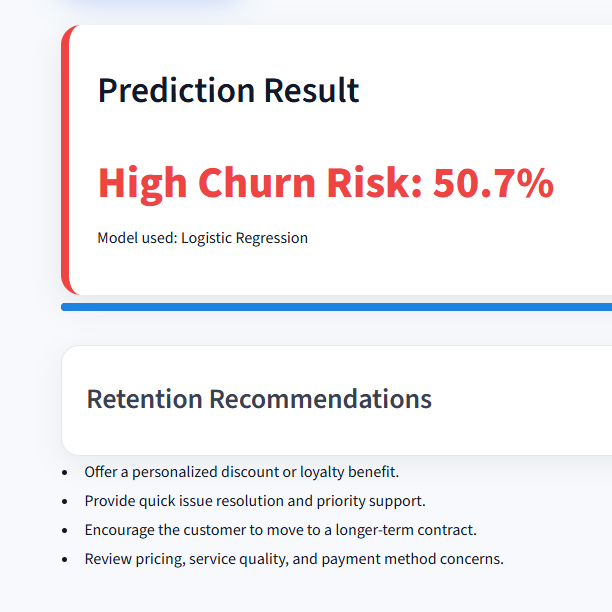
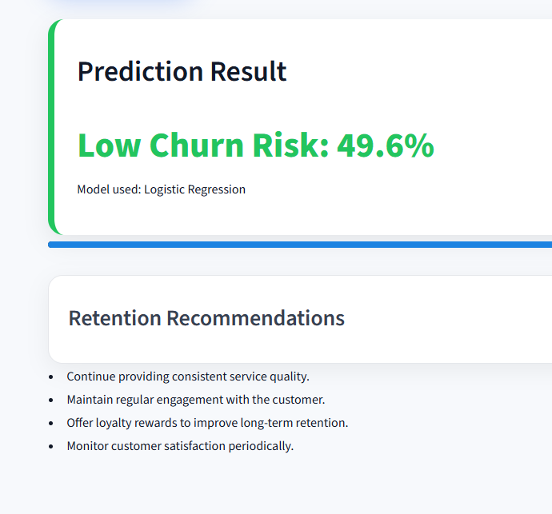

# Customer Retention Intelligence System

## Overview

Customer churn is one of the biggest challenges faced by subscription-based businesses. Losing existing customers not only reduces revenue but also increases acquisition costs.

This project uses Machine Learning to predict whether a telecom customer is likely to churn based on customer demographics, service usage, contract details, and billing information. The application is deployed as an interactive Streamlit web application that enables users to enter customer information and receive churn predictions along with retention recommendations.

---

## Live Demo

Streamlit App: https://flood-guard-ai.streamlit.app/

GitHub Repository: https://customer-churn-intelligence-ml.streamlit.app/

---

## Features

- Customer churn prediction using Logistic Regression
- Interactive Streamlit web application
- Input validation for reliable predictions
- Personalized retention recommendations
- Probability-based churn risk estimation
- Business insights through Power BI dashboard

## Business Problem

Customer acquisition is significantly more expensive than customer retention. Identifying customers who are likely to leave allows organizations to take proactive retention measures such as personalized offers, contract upgrades, and improved customer support.

---

## Dataset

**Source:** IBM Telco Customer Churn Dataset (Kaggle)

**Dataset Size**
- 7,044 customer records
- 21 input features
- Target Variable: Churn (Yes / No)

To simulate real-world scenarios, multiple data quality issues were intentionally introduced before preprocessing, including:

- Missing values
- Duplicate records
- Inconsistent categorical values
- Incorrect data types
- Outliers
- Noise columns

---

## Technologies Used

- Python
- Pandas
- NumPy
- Scikit-learn
- Logistic Regression
- SMOTE
- SHAP
- Matplotlib
- Seaborn
- Streamlit
- Power BI
- Git & GitHub

---

## Project Workflow

1. Business Understanding
2. Data Collection
3. Data Quality Issue Injection
4. Data Cleaning and Preprocessing
5. Exploratory Data Analysis
6. Feature Engineering
7. Class Balancing using SMOTE
8. Model Training
9. Model Evaluation
10. SHAP Explainability
11. Power BI Dashboard
12. Streamlit Web Application

---

## Model Performance

| Model | Accuracy | Precision | Recall | F1 Score | AUC |
|--------|---------:|----------:|--------:|---------:|----:|
| Logistic Regression | 74.6% | 51.4% | **77.5%** | 61.8% | **84.0%** |
| Random Forest | 77.7% | 57.9% | 58.6% | 58.2% | 81.8% |
| XGBoost | 77.8% | 58.0% | 58.8% | 58.4% | 82.0% |

### Selected Model

**Logistic Regression**

The model was selected because it achieved the highest Recall and AUC score. In customer churn prediction, identifying potential churners is more important than maximizing overall accuracy, making Logistic Regression the most suitable model for deployment.

---

## Key Business Insights

- Customers with month-to-month contracts have a higher likelihood of churning.
- Customers in the early months of their subscription are more likely to leave.
- Fiber optic internet users exhibit comparatively higher churn.
- Higher monthly charges are associated with increased churn probability.
- Long-term contracts significantly reduce churn.

---

## Streamlit Application

The Streamlit application enables users to:

- Enter customer information
- Predict churn probability
- Identify High Risk and Low Risk customers
- View personalized retention recommendations
- Validate user inputs before prediction

---

## Application Screenshots

### Home Page

### High Churn Prediction

### Low Churn Prediction

### High Churn Recommendation

### Low Churn Recommendation

---

## Power BI Dashboard

The Power BI dashboard provides business insights through interactive visualizations including:

- Customer Overview
- Churn Analysis
- Contract Analysis
- Internet Service Analysis
- SHAP Feature Importance

---

---

## Future Enhancements

- Cloud deployment
- Customer segmentation
- Email-based retention alerts
- Explainable AI dashboard
- Real-time prediction API

---

## Author

**Thanha Shajahan**

Machine Learning | Data Analytics | Python | SQL | Power BI
